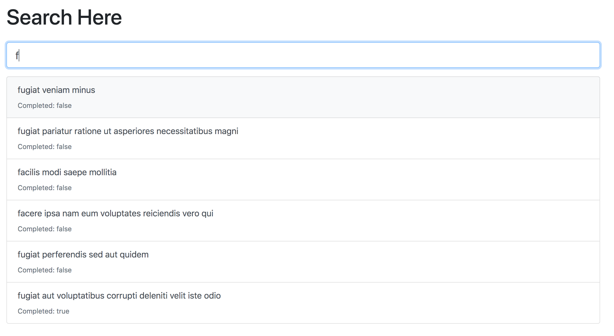

# Auto-complete search field
## Simple autocomplete of a search box 



To view the application, visit [neerajkulk.github.io/autocomplete_search/](https://neerajkulk.github.io/autocomplete_search/) and start typing into the input field.


 Based on some placeholder data in ```main.js```, we filter the search results using regular expressions. This is implemented in the ```filterResults``` function in ```main.js``` and takes ```limit``` as an argument corresponding to the max number of results you want to display. Of course, you can replace the placeholder data with whatever you want or use an external API. Since we look for a match row by row and limit the total number of matches, this simple implementation should be able to handle millions of rows of data. 

To take this a step further, we could cache autocomplete results for the most common searches to speed things up.

